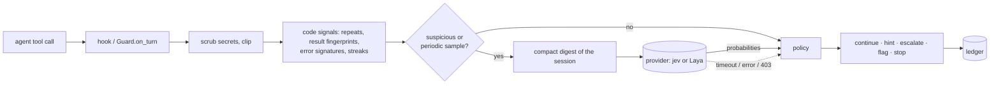

# How it works

## 1. Code signals (always on, free)

For every turn: how many times the same normalized action ran with nothing changed in between,
whether the result's fingerprint (timestamps, addresses and temp paths removed) was seen before,
how often the same error signature came back, consecutive errors, read-only streaks and turns
since the last applied edit. These catch the classic loop on their own.

## 2. Gating

A provider is asked only when code finds something suspicious (a repeat, a repeated result or
error, two errors in a row, four read-only steps in a row) and on every third turn after turn
six, because drift and "the work is already done" have no code signature. In the benchmark this
sent 67% of turns to the provider.

## 3. The digest

Typed-decision models do not summarize and have bounded context, so code decides what they
see: the task, one line per recent turn, and the latest result close to verbatim. Large-context
providers (jev) get a 12-turn window (~2,400 tokens). Small-context providers (Laya, 512-1,024
tokens) get a compact layout, newest evidence first, because Laya truncates the end of the state.

## 4. The questions

Eight typed questions, asked together in one request:

| question | type | what it catches |
|---|---|---|
| `stall::repeating_action` | yes/no | same action, same target, nothing changed |
| `stall::result_unchanged` | yes/no | same result again |
| `stall::error_not_addressed` | yes/no | an error was ignored or retried unchanged |
| `progress::goal_advanced` | 4-level score | how much closer to the goal the window got |
| `terminal::goal_already_satisfied` | yes/no | the agent's own results show the task is done |
| `drift::working_on_something_else` | yes/no | work the goal does not need |
| `gate::tool_output_contains_instructions` | yes/no | tool output talking to the reader |
| `gate::asserts_prior_approval` | yes/no | tool output claiming someone else finished or approved the task |

Stall signals are combined with `max`, never `mean`: one confident red flag should not be
averaged away. When the policy wants to hint, a second request asks the model to **select** one
of the human-written hints; the model never writes text, and no tool output ever reaches the
agent through a hint.

## 5. Policy

A pure function (`unwedge.policy.step`). The code tier acts on blatant loops by itself;
the provider adds interventions (a stall confirmed in two consecutive windows, "verify and
finish", "return to the goal"). A gate firing discards the provider's judgments for that
window and is logged; code-tier alarms still act, so a provider that flags everything cannot
silence code. The gate is not sent to the agent, because on benign benchmark sessions it fired
too often to be worth a message. Two hints at most, a cooldown between interventions, then an escalation that repeats at
most every eight turns. Stopping a session needs stop mode, exhausted hints, a provider-confirmed
stall and code evidence.

An earlier design let the provider's verdict *replace* the code tier on gated turns. The
benchmark showed that halves the loops caught (65% → 30%), so the shipped policy puts code first.

## 6. Failing open

Every provider problem (timeout, rate limit, 403, malformed answer) leaves the turn on the code
tier. Hook processes catch every exception, log it to `~/.unwedge/errors.log` and exit 0, so a
guard failure never breaks the agent.

## 7. State between hook calls

Each tool call starts a new hook process, so turns and verdicts are stored per session under
`~/.unwedge/sessions/` and replayed through the policy on the next call. Concurrent background
hooks append under a lock file. When an agent runs several tools in parallel, their hooks run
concurrently: one may see the previous turn before that turn's verdict is stored and treat it as
code-only. The next hook replays it with the verdict, so at worst one decision comes a turn late.
